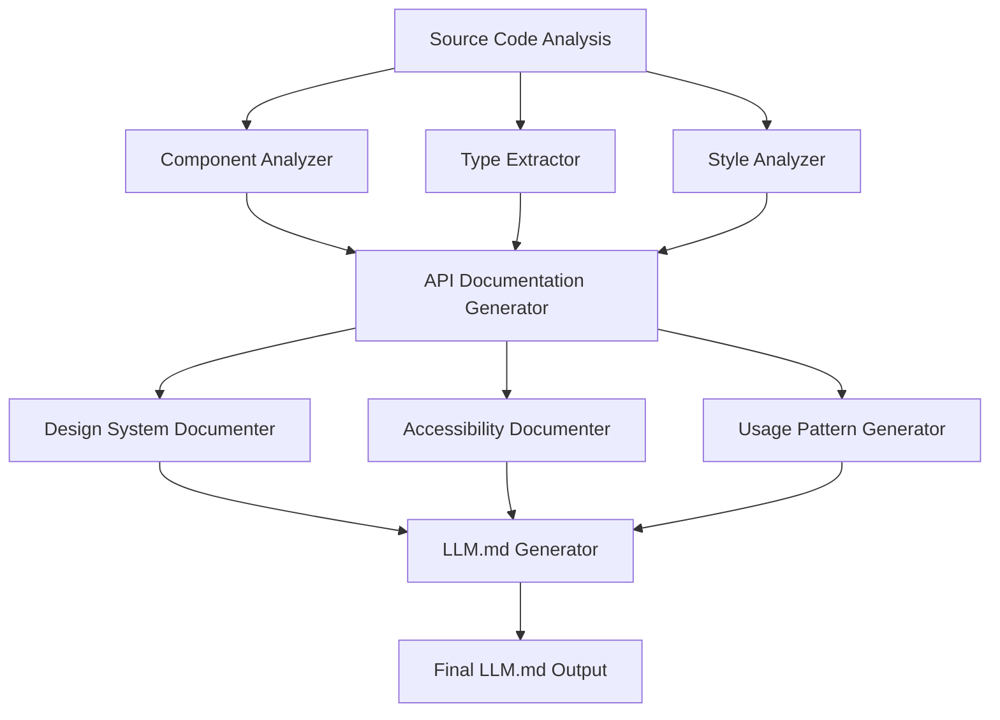

# Design Document

## Overview

The LLM Documentation Generator creates a comprehensive, structured markdown file that serves as the ultimate API reference for the SV Project Helper UI Library. The system analyzes the entire component library, extracts APIs and patterns, and generates LLM-optimized documentation that enables AI assistants to provide accurate guidance on component usage, theming, accessibility, and best practices.

## Architecture

### High-Level Architecture



### Component Analysis Pipeline

1. **File System Scanner**: Recursively scans `src/lib/ui/` directory structure
2. **Component Parser**: Extracts Svelte component structure, props, and TypeScript interfaces
3. **Style Extractor**: Analyzes CSS custom properties and glassmorphism patterns
4. **Documentation Aggregator**: Combines all extracted information into structured format
5. **Markdown Generator**: Produces LLM-optimized markdown with consistent formatting

## Components and Interfaces

### Core Analysis Components

#### ComponentAnalyzer
```typescript
interface ComponentAnalyzer {
  analyzeComponent(filePath: string): ComponentInfo;
  extractProps(component: SvelteComponent): PropDefinition[];
  extractEvents(component: SvelteComponent): EventDefinition[];
  extractSlots(component: SvelteComponent): SlotDefinition[];
}

interface ComponentInfo {
  name: string;
  category: 'atom' | 'molecule' | 'organism' | 'layout' | 'util';
  description: string;
  props: PropDefinition[];
  events: EventDefinition[];
  slots: SlotDefinition[];
  accessibility: AccessibilityFeatures;
  examples: UsageExample[];
}
```

#### TypeExtractor
```typescript
interface TypeExtractor {
  extractInterfaces(filePath: string): TypeDefinition[];
  extractEnums(filePath: string): EnumDefinition[];
  resolveTypeReferences(type: string): ResolvedType;
}

interface PropDefinition {
  name: string;
  type: string;
  required: boolean;
  defaultValue?: any;
  description: string;
}
```

#### StyleAnalyzer
```typescript
interface StyleAnalyzer {
  extractCSSCustomProperties(filePath: string): CSSProperty[];
  analyzeGlassmorphismPatterns(styles: string): GlassEffect[];
  extractResponsiveBreakpoints(styles: string): Breakpoint[];
}

interface CSSProperty {
  name: string;
  defaultValue: string;
  description: string;
  category: 'color' | 'spacing' | 'typography' | 'effect';
}
```

### Documentation Generation Components

#### DesignSystemDocumenter
```typescript
interface DesignSystemDocumenter {
  generateThemeDocumentation(): ThemeDocumentation;
  generateGlassmorphismGuide(): GlassmorphismGuide;
  generateResponsiveGuide(): ResponsiveGuide;
}

interface ThemeDocumentation {
  colorSystem: ColorDefinition[];
  spacingSystem: SpacingDefinition[];
  typographySystem: TypographyDefinition[];
  customProperties: CSSProperty[];
}
```

#### AccessibilityDocumenter
```typescript
interface AccessibilityDocumenter {
  generateAccessibilityGuide(component: ComponentInfo): AccessibilityGuide;
  extractARIAPatterns(component: ComponentInfo): ARIAPattern[];
  extractKeyboardPatterns(component: ComponentInfo): KeyboardPattern[];
}

interface AccessibilityGuide {
  ariaAttributes: ARIAAttribute[];
  keyboardNavigation: KeyboardShortcut[];
  focusManagement: FocusPattern[];
  screenReaderSupport: ScreenReaderFeature[];
}
```

## Data Models

### Component Documentation Model
```typescript
interface ComponentDocumentation {
  metadata: {
    name: string;
    category: ComponentCategory;
    version: string;
    lastUpdated: Date;
  };
  api: {
    props: PropDefinition[];
    events: EventDefinition[];
    slots: SlotDefinition[];
    methods: MethodDefinition[];
  };
  styling: {
    cssProperties: CSSProperty[];
    variants: VariantDefinition[];
    themes: ThemeOption[];
  };
  accessibility: AccessibilityGuide;
  examples: UsageExample[];
  bestPractices: BestPractice[];
}
```

### LLM Documentation Structure
```typescript
interface LLMDocumentation {
  header: DocumentationHeader;
  quickReference: QuickReferenceGuide;
  designSystem: DesignSystemDocumentation;
  components: {
    atoms: ComponentDocumentation[];
    molecules: ComponentDocumentation[];
    organisms: ComponentDocumentation[];
    layouts: ComponentDocumentation[];
    utils: ComponentDocumentation[];
  };
  patterns: UsagePattern[];
  accessibility: GlobalAccessibilityGuide;
  troubleshooting: TroubleshootingGuide;
}
```

## Error Handling

### File Analysis Errors
- **Missing Component Files**: Log warning and continue with available components
- **Parse Errors**: Capture syntax errors and provide fallback documentation
- **Type Resolution Failures**: Document as `unknown` type with warning note
- **Missing Dependencies**: Document external dependencies and installation requirements

### Documentation Generation Errors
- **Template Rendering Failures**: Use fallback templates for critical sections
- **Cross-Reference Failures**: Generate placeholder links for missing references
- **Example Generation Failures**: Provide basic usage examples as fallback
- **Validation Errors**: Include validation warnings in generated documentation

### Recovery Strategies
```typescript
interface ErrorRecovery {
  handleParseError(error: ParseError, component: string): PartialDocumentation;
  generateFallbackDocumentation(componentName: string): BasicDocumentation;
  validateGeneratedDocumentation(doc: LLMDocumentation): ValidationResult;
}
```

## Testing Strategy

### Unit Testing
- **Component Analysis**: Test prop extraction, type resolution, and API documentation
- **Style Analysis**: Test CSS custom property extraction and glassmorphism pattern detection
- **Documentation Generation**: Test markdown generation and template rendering
- **Error Handling**: Test recovery mechanisms and fallback documentation

### Integration Testing
- **End-to-End Pipeline**: Test complete documentation generation from source to output
- **Cross-Component References**: Test component relationship documentation
- **Design System Integration**: Test theme and styling documentation accuracy
- **Accessibility Validation**: Test WCAG compliance documentation generation

### Validation Testing
- **Documentation Completeness**: Ensure all components are documented
- **API Accuracy**: Validate generated API documentation against source code
- **Example Validity**: Test that all code examples are syntactically correct
- **LLM Optimization**: Test documentation effectiveness with actual LLM interactions

### Performance Testing
- **Large Codebase Handling**: Test performance with full component library
- **Memory Usage**: Monitor memory consumption during analysis
- **Generation Speed**: Benchmark documentation generation time
- **Output Size**: Optimize generated documentation size for LLM context limits